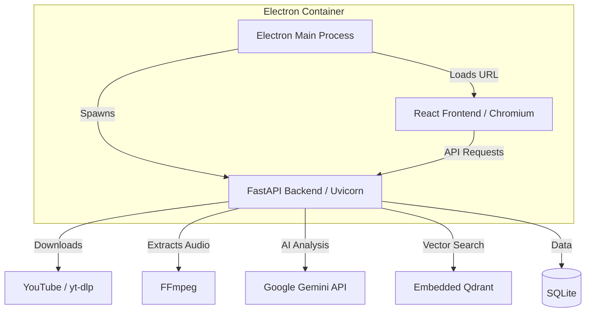
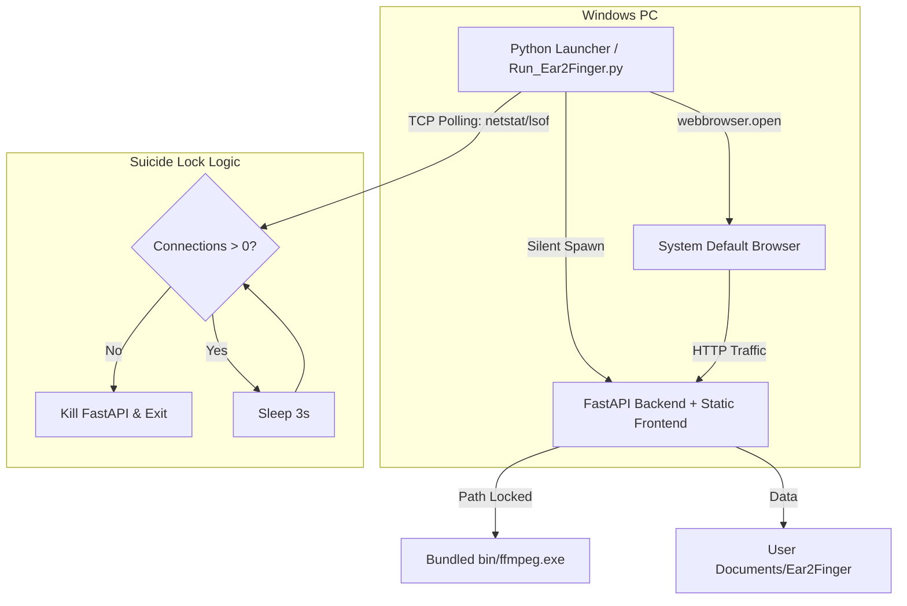

# Ear2Finger 项目源码分析报告

## 1. 总体架构概览
Ear2Finger 采用现代的 **Monorepo** 架构，将前后端逻辑解耦，通过 API 进行通信。在当前 `electron` 分支中，它通过 Electron 容器将两者打包在一起。

### 1.1 核心技术栈
- **后端 (Backend):** FastAPI (Python 3.12), SQLAlchemy (SQLite), LangChain (Gemini API), Qdrant (嵌入式向量数据库).
- **前端 (Frontend):** React + TypeScript, Vite, Tailwind CSS.
- **基础依赖:** `ffmpeg` (音频处理), `yt-dlp` (YouTube 下载与解析).

## 2. 系统架构图 (Current vs. Future)

### 2.1 当前 Electron 架构

### 2.2 目标 Lite 独立架构 (Browser-as-UI)

## 3. 核心模块深入分析

### 3.1 进程管理与自杀锁 (The Launcher)
- **无窗口运行**: 使用 `subprocess.Popen` 的 `CREATE_NO_WINDOW` 标记（Windows 专属）实现后台静默运行。
- **自动唤醒**: 利用 Python 内置的 `webbrowser` 模块调用系统默认浏览器。
- **生命周期绑定**: 通过轮询监听后端端口（如 9528）的 TCP 连接状态。当浏览器标签页关闭，连接数从 `ESTABLISHED` 变为 0 时，启动器自动收割后端进程并自杀，实现“随开随关”。

### 3.2 YouTube 处理流程 (`backend/services/youtube_processor.py`)
- **yt-dlp:** 用于获取视频元数据和下载。
- **音频提取:** 调用 `ffmpeg` 将视频转为 mp3，并根据字幕时间戳进行切片。这是重构中需要“路径锁定”的核心点。

### 3.3 AI 助教与向量检索 (`backend/services/qdrant_client.py`)
- 使用 Qdrant 的本地模式（`location=":memory:"` 或本地路径），无需启动独立 Docker 容器。
- 通过 LangChain 接入 Gemini，实现错题分析和相似句型推荐。

### 3.4 前端构建流程 (`frontend/`)
- 使用 Vite 进行极速构建。
- **API 通信:** 前端通过相对路径 `/api` 发送请求。

## 4. 扩展性分析 (Extensibility)

### 4.1 多平台支持 (Bilibili)
- `yt-dlp` 已原生支持 Bilibili。重构时只需在 `youtube_processor.py` 中通过正则识别 B站 URL，并传递 `--write-subs` 与 `--sub-langs zh-Hans` 即可提取中文字幕。

### 4.2 本地媒体处理
- 引入本地文件导入机制。后端通过 `FastAPI` 的 `UploadFile` 接收文件，或在本地模式下直接读取指定路径，调用 `ffmpeg` 提取音频流（MP3/WAV），并生成对应的数据模型以复用现有的听写逻辑。

### 4.3 多模型适配 (DeepSeek/OpenAI)
- 利用 LangChain 的 `ChatOpenAI` 抽象，通过在 `.env` 中配置 `OPENAI_API_BASE` 为 `https://api.deepseek.com`，即可无缝切换至 DeepSeek 模型。后续可进一步支持多种 OpenAI 兼容的本地或云端大模型。

## 5. 关键路径与依赖
- **配置文件:** `.env` 管理 API Key 和运行模式。
- **数据库迁移:** `backend/database.py` 自动处理 SQLite 表结构创建。
- **打包配置:** `backend/electron_backend.spec` 定义了 PyInstaller 如何收拢 Python 环境。

## 5. 重构关注点
1. **静态资源路径:** 确保 `frontend/dist` 在 Mac mini 编译后能被 Python 正确识别。
2. **FFmpeg 绑定:** 将 `ffmpeg.exe` 放入 `bin/` 目录，并在代码中通过 `os.environ["PATH"]` 动态注入。
3. **网络自杀锁:** 在 `Launcher` 中实现 TCP 状态检测，确保浏览器关闭后后端进程自动退出。
