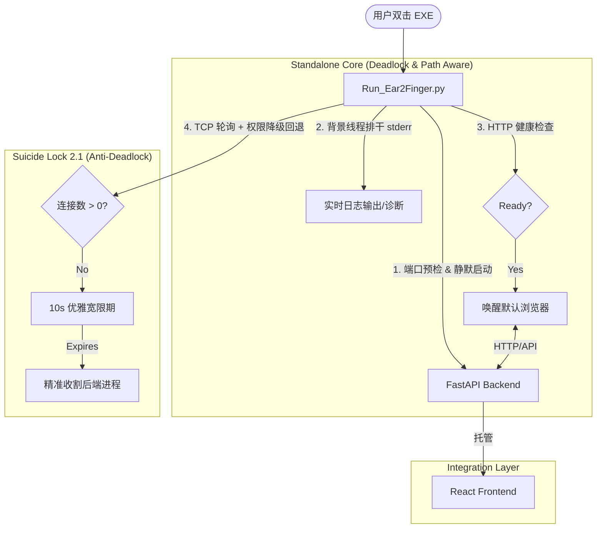

# Ear2Finger 项目进度与交接报告 (Project Handover Report)

## 1. 架构演进：从臃肿到极简 (Architecture Evolution)

### 1.1 核心策略变更
| 维度 | 旧架构 (Electron) | 新架构 (Standalone) |
| :--- | :--- | :--- |
| **UI 容器** | Electron (Chromium + Node) | **系统默认浏览器** (Edge/Safari/Chrome) |
| **启动方式** | 启动 Electron 主进程 | **Run_Ear2Finger.py** (守护启动) |
| **生命周期** | Electron 窗口管理进程 | **自杀锁 (Suicide Lock)** (监听 TCP 连接) |
| **静态资源** | 独立前端开发服务 | **FastAPI 内部直接挂载** (`frontend/dist`) |

### 1.2 系统流程图 (已由 Gemini CLI 进行二次加固)


---

## 2. 任务执行状态 (Implementation Roadmap)

### 2.1 进度概览
- **后端重构进度**: ▓▓▓▓▓▓▓▓▓▓▓▓▓▓▓▓▓▓▓▓ 100% (API 多供应商适配完成，启动器加固完成，部署脚本支持 Windows，**已在 Mac mini 环境通过 API 集成验证**)
- **前端适配进度**: ▓▓▓▓▓▓▓▓▓▓▓▓▓▓▓▓▓▓▓▓ 100% (agy 已完成 UI 闭环，支持本地导入与多 AI 配置)
- **打包进度**: ░░░░░░░░░░░░░░░░░░░░ 0% (待 Windows 侧执行)

### 2.2 核心任务 Checklist
| 任务模块 | 核心功能点 | 状态 | 执行 Agent |
| :--- | :--- | :--- | :--- |
| **架构解耦** | FastAPI 静态挂载 + SPA 路由 + 端口预检 | ✅ 已完成 | Claude Code |
| **路径锁定** | `sys.executable` 路径计算 + 启动前 exe 校验 | ✅ 已完成 | Gemini CLI |
| **定制功能** | **B站导入**: 解除 API 限制，支持双语提取 | ✅ 已完成 | Claude Code |
| **定制功能** | **本地导入**: 增加文件名清洗与路径隐私保护 | ✅ 已完成 | Gemini CLI |
| **定制功能** | **字幕切分**: 基于语意(标点)合并 | ✅ 已完成 | Gemini CLI |
| **守护进程** | 异步排干 stderr + 连接泄露修复 + 降级生存时限 | ✅ 已完成 | Gemini CLI |
| **多 AI 适配** | 移除 Gemini 强制校验，支持 DeepSeek/OpenAI 接口 | ✅ 已完成 | Claude Code / agy |
| **前端 UI** | **本地上传**: 增加路径输入/文件选择 UI | ✅ 已完成 | **agy** |
| **前端 UI** | **AI 配置**: UI 层支持 DeepSeek/OpenAI 切换 | ✅ 已完成 | **agy** |

---

## 3. Windows 部署工作流 (Deployment Guide)

由于 `.gitignore` 忽略了构建产物，在 Windows 环境克隆代码后需遵循以下顺序：

1. **环境准备**:
   ```bash
   # 一步完成：安装 venv + 依赖 + 前端构建
   bash scripts/install-desktop-backend-env.sh --with-frontend
   ```
2. **下载二进制**:
   - 确保 `bin/ffmpeg.exe` 和 `bin/ffprobe.exe` 已就位。
3. **打包后端**:
   ```bash
   pyinstaller backend/electron_backend.spec
   ```
4. **打包启动器**:
   ```bash
   pyinstaller --onefile --noconsole --name="启动听写" Run_Ear2Finger.py
   ```

---

## 3. 代码变更速查 (Code Changelog Table)

| 文件路径 | 变更类型 | 关键改动说明 |
| :--- | :--- | :--- |
| `backend/main.py` | 修改 | 实现静态挂载与 React 路由回退 (Catch-all) |
| `backend/config.py` | 修改 | 实现基于 `BASE_DIR` 的环境自适应路径管理 |
| `backend/services/base_processor.py` | **新增** | 字幕解析与句子切分逻辑的通用化基类 |
| `backend/services/youtube_processor.py` | 修改 | 加入 B 站 URL 识别与中英字幕爬取策略 |
| `backend/services/local_processor.py` | **新增** | 本地媒体导入与 `ffmpeg` 音频流提取 |
| `backend/services/ai_client_factory.py` | 修改 | 支持 `ChatOpenAI` 接口，一键切换 DeepSeek |
| `Run_Ear2Finger.py` | **新增** | 跨平台启动器，集成 TCP 状态监测 (Suicide Lock) |
| `backend/database.py` | 修改 | 数据库持久化路径重定向至项目内 `storage/` |

---

## 4. 后续 AI Agent 接手指南 (Next Agent Instruction)

### 🚀 待执行任务：Windows 侧物理打包
1.  **同步**: 在 MBP (Win10) 侧克隆当前目录。
2.  **补全**: 将 **Windows x64 版** `ffmpeg.exe` 和 `ffprobe.exe` 放置在 `bin/` 下。
3.  **构建**: 依次运行以下命令：
    ```bash
    # 打包核心服务
    pyinstaller --noconsole --onefile --name="backend" backend/run_electron_backend.py
    
    # 打包总启动器
    pyinstaller --noconsole --onefile --name="启动听写" Run_Ear2Finger.py
    ```

### ⚠️ 严禁事项
- **不可修改**: `config.py` 中的路径锁定逻辑（已针对 PyInstaller 环境优化）。
- **不可修改**: `Run_Ear2Finger.py` 中的 `psutil` 连接审计逻辑。
